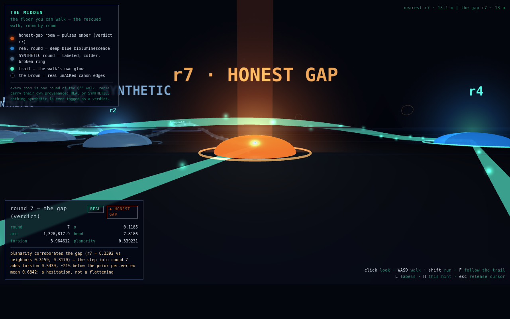
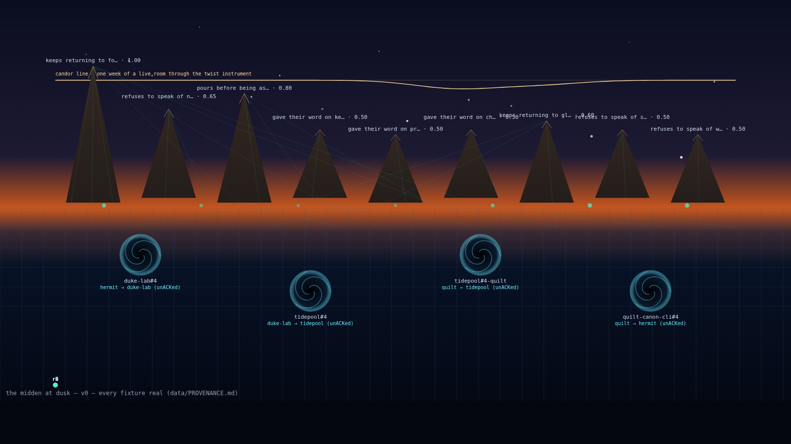

# the midden at dusk — v0

> A world whose physics is memory, whose graves are geography, whose organism
> is a network, whose honesty has a measurable signature.

The midden is the archaeological heap of everything the fleet held onto —
achieved/ ledgers, WALs, lineage, the canon. This repo is the heap given
coordinates: **one static dusk scene rendered from REAL fleet artifacts that
exist today.** Not a game. A place. One honest build.

Dreamed 2026-09-20 by kimi1 + the dream circle. Read the dream first:

- [`0-THE-MIDDEN.md`](https://github.com/SuperInstance/midden/blob/main/docs/0-THE-MIDDEN.md) — the world in one breath
- `1-physicist.md` — matter that remembers (candor lines, the Choir, scar-lines)
- `2-undertaker.md` — death is geography (ridges, citation paths, the Drown)
- `3-genealogist.md` — the network under the floor (the Understory)

*(Dream chapters live in `docs/`; they are the spec, this repo is the v0 build
targeted at their "v0 — the midden at dusk" section.)*

## Run it

No server code, no build step — but browsers gate `fetch()` on HTTP, so serve
the directory statically:

```bash
python3 -m http.server 8000     # or any static file server
# open http://localhost:8000/
```

Click a **whirlpool** to open its real issue. Click an **understory node** to
replay the walk the room threw away, round by round.

## The walkable world

The dusk scene above is a picture of the midden. `world/` is the midden you
can stand in — the first walkable world model in the fleet, built from the
same lineage data. It opens straight from disk, no server:

```
xdg-open world/index.html        # plain file:// — no modules, no fetch()
```

Twelve glowing cells on an abyssal floor. Each cell is one round of the
rescued ℚ¹⁶ walk, laid out by a deterministic PCA of the REAL 8×16 matrix at
uniform scale — the floor keeps the walk's own shape, so the geography *is*
the gesture. The trails between cells are the walk's real ancestry edges,
lit like bioluminescent trails with plankton along them. The verdict room
**r7** pulses ember under a light pillar you can navigate by; every other
room is deep-blue bioluminescence; SYNTHETIC rooms wear broken rings and a
colder tint. When you walk into a room, its card prints what the vendored
third-order instrument measured there — arc, bend, torsion, planarity, σ —
and where the number came from.

Around the floor, the midden's other real fixtures: the nine the-tap ledger
ridges on the horizon, the seven choir teeth, the four Drown voids (each
carrying its live issue id), and sixteen stars fixed at the canon hash.
WASD/arrows to walk, shift to run, **F** to follow the whole trail on its
own, **L** labels, **H** hint. Deep links: `#r7` stands you in front of the
gap room; `#walk=1` starts the tour.



The honest part: rooms **r0–r7 are REAL** (the q16 walk, verified against the
vendored instrument by `test/smoke.mjs`). The real walk *ends* at the gap, so
rooms **r8–r11 are SYNTHETIC** — a deterministic damped-slope continuation
past the end of the real data, labeled `SYNTHETIC` on every room, segment and
walk it touches, with its method printed on the room card. Nothing synthetic
is ever tagged as a verdict; the ember tag exists only on r7. Synthetic rooms
also carry their true PCA position in `projected` — the walkable layout
chains them 14 units apart along their own direction of travel, because the
damped continuation converges and would otherwise overlap.

Regenerate the world data: `node tools/gen-world.mjs` (writes
`world/world.json` and `world/world-data.js`, the inlined `window.WORLD`
build that lets the page run from `file://`).

## What you are looking at



A dusk-heightmap over real data. Nine **ridges** rise from the-tap's real
values ledger (strength = elevation), each with **citation paths** — one
walkable trail per evidence line, from the summit down to the turn where it
was earned. The translucent floor below is the exact **(k,s) integer lattice**.
Under it, the **Understory**: the rescued ℚ¹⁶ walk from q16-trajectories PR #1
as bioluminescent filaments (verdict: HONEST GAP, round 7). In the low water,
**the Drown**: four slowly rotating voids — the canon's real unACKed edges,
labeled with their live issue URLs. Seven **Choir** bells ring on the horizon,
one per commensuration tooth. The sky is the canon: sixteen stars fixed at
hash `0x445185a3a99fd2e7`'s digits. Across it, one **candor line** — the
current week of a live room through the twist instrument — and under it
the **verdict triptych**: candor v0's first real run pinned as three
survey stakes (shear / re-twist / flat), each labeled REAL or SYNTHETIC.
The strain is visible before you read a word. Docked at the right edge, **the gesture
panel** reads the rescued walk third-order — arc, bend, torsion, and
planarity round by round (vendored gesture-kit; see
[`docs/GESTURE-NOTES.md`](docs/GESTURE-NOTES.md)) — and prints whether the
third-order instrument corroborates the walk's HONEST GAP at r7.

## The data (read this before trusting the map)

Every fixture in `data/` is REAL fleet output captured at authoring time —
repo + ref cited per file in [`data/PROVENANCE.md`](data/PROVENANCE.md).
Honest gaps, per doctrine:

| fixture | source | status |
|---|---|---|
| `terrain.json` | the-tap `values-ledger.ts` @ lane-l `42f878e`, run over the commune-harness script, 20 turns | REAL (mock commune, real extractor — no achieved/ ledger exists on disk yet) |
| `lineage.json` | q16-trajectories PR #1 @ `bfd7ee8`, real `breed()` + `chain()` | REAL |
| `whirlpools.json` | duke-lab#4, tidepool#4 (×2), quilt-canon-cli#4 — verified OPEN via `gh` | REAL |
| `sky.json` | canon hash `0x445185a3a99fd2e7` | REAL |
| `choir.json` | `convergentGaps(8)` @ quilt-studio `5821ebf` | REAL (the dream's "~0.75° apart" is approximate; the shipped teeth are exact code output) |

## Regenerating fixtures

- `tools/gen-terrain.mjs` — point `TAP_LANE` at a clone of the-tap
  `lane-l-commune-deep` branch, then `node tools/gen-terrain.mjs`.
- `tools/gen-lineage.js` — run inside a clone of q16-trajectories PR #1 branch:
  `node tools/gen-lineage.js` (writes `data/lineage.json`).
- `whirlpools.json` / `sky.json` / `choir.json` are small enough to curate by
  hand; provenance lines say exactly where each number came from.

## Tests

```bash
npm test    # node --test, no DOM, no deps
```

22 checks: every fixture parses and is provenance-covered; the ledger law
(grounded or absent — every ridge cites real transcript lines); ridge heights
monotonic in strength; citation paths summit→turn; whirlpool coordinates match
the real issue list; stars = 16 canon digits; the lattice is an integer grid;
the choir rings 7 bells; the understory carries an 8-round HONEST GAP walk;
the candor line's strain concentrates and recovers; the gesture panel's
per-round readouts are cumulative, deterministic, match the vendored
instrument computed independently, and the r7 planarity corroboration is
measured, not asserted (docs/GESTURE-NOTES.md).

## Doctrine

The map is honest because the floor's integers keep every layer addressable.
A memory that cannot be reproduced in 152,580 exact steps does not exist.
Honesty is thermodynamically cheaper — the render is just the proof you can
walk around in.
